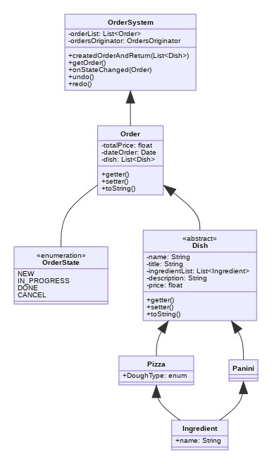

# backend-orders-patterns-jeremy-adrien-viktor

## BackLog

[Backlog sur trello](https://trello.com/b/cFfG6QOI/project-design-patterns)

## Design Patterns

- [[Observer]](https://refactoring.guru/design-patterns/observer)

- [[Memeno]](https://refactoring.guru/design-patterns/memento)

## Diagramme de classe UML

  
  
## Diagramme de séquence UML

  